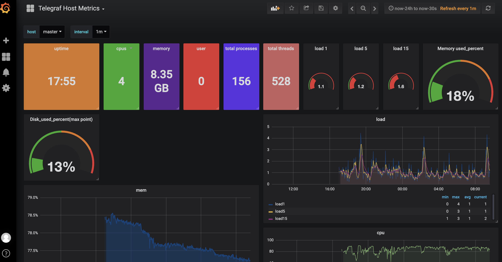
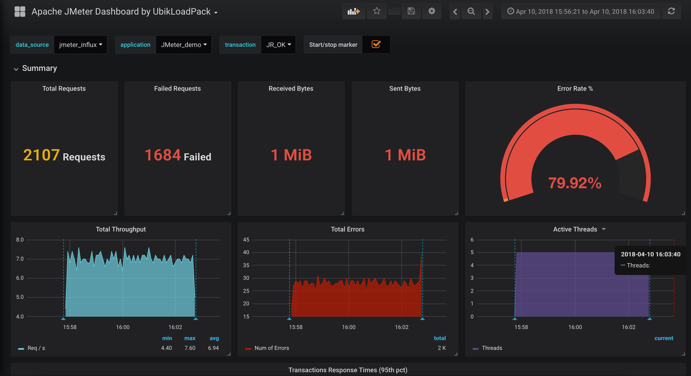

# Distributed Stress Test System

## 1. Preparation

### 1.1 Images
```sh
grafana/grafana:5.0.1

influxdb:1.1.0

openjdk:8
```
### 1.2 Build Images
```sh
docker build -t jmeter-master:5.6.3 -f docker/Dockerfile-Master ./

docker build -t jmeter-slave:5.6.3 -f docker/Dockerfile-Slave ./
```
### 1.3 Cluster
```sh
kubectl get node

#master    Ready    control-plane,master   6h32m   v1.23.6
#slave01   Ready    <none>                 6h32m   v1.23.6
#slave02   Ready    <none>                 6h32m   v1.23.6
```


## 2. Deploy

### 2.1 Influxdb
```sh
kubectl create ns influxdb

kubectly apply -f deploy/influxdb.yaml -n influxdb

sleep 10

echo 'create database jmeter'
curl -X POST 'http://fixedIP:30001/query?q=create+database+%22jmeter%22&db=_internal'
#{"results":[{}]}

echo 'create database telegraf'
curl -X POST 'http://fixedIP:30001/query?q=create+database+%22telegraf%22&db=_internal'
#{"results":[{}]}
```
### 2.2 Telegraf
```sh
#version: 1.7.3
telegraf --config conf/telegraf.conf
```
### 2.3 Grafana
```sh
kubectl create ns grafana

kubectly apply -f deploy/grafana.yaml -n grafana

# login http://fixedIP:30003/login
# username/passwd: admin/admin
# add data source DS_BLZAEDEMO and DS_TELEGRAF
# load dashboard template conf/telegraf.json and conf/jmeter.json
```
### 2.4 Jmeter
```sh
kubectl create ns jmeter

kubectly apply -f deploy/jmeterSlave.yaml -n jmeter
```


## 3. Start Test

### Jmeter Master
```sh
slaveIp=`kubectl get pod -n jmeter -o wide| grep jmeter-slave |grep Running| awk -F' ' '{printf $6","}'| awk '{print substr($1,0,length-1)}'`

cp conf/jmeter.properties.org conf/jmeter.properties

echo "remote_hosts=""$slaveIp" >> conf/jmeter.properties

kubectl create configmap jmeterconfig --from-file=conf/jmeter.properties -n jmeter

# prepare jmeter test jmx
kubectl create configmap testplan --from-file=testplan.jmx -n jmeter

kubectl apply -f deploy/jmeterMaster.yaml -n jmeter

kubectl logs jmeter-master -n jmeter
```


## 4. Preview

### 4.1 Telegraf


### 4.2 Jmeter



